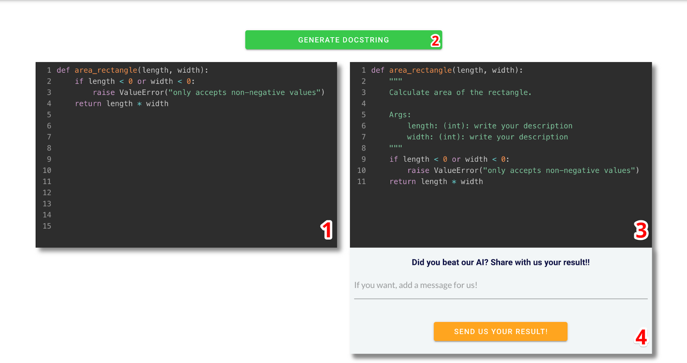
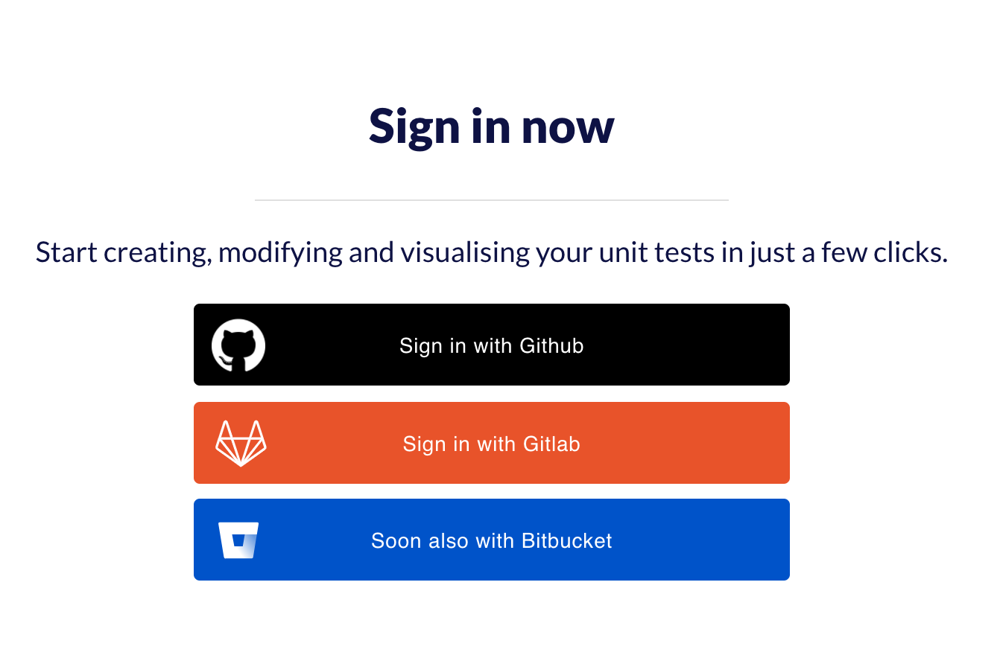
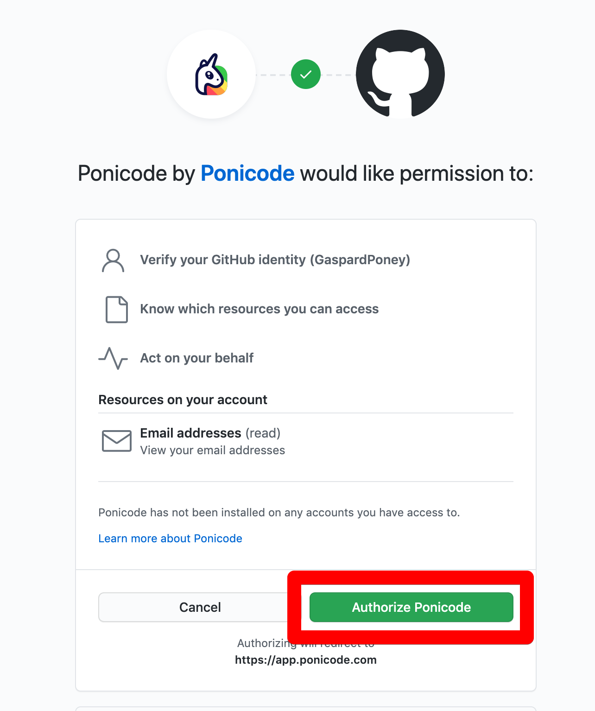
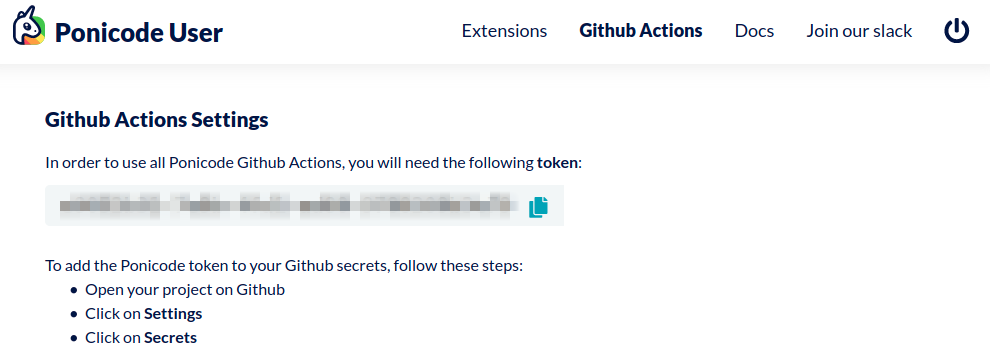
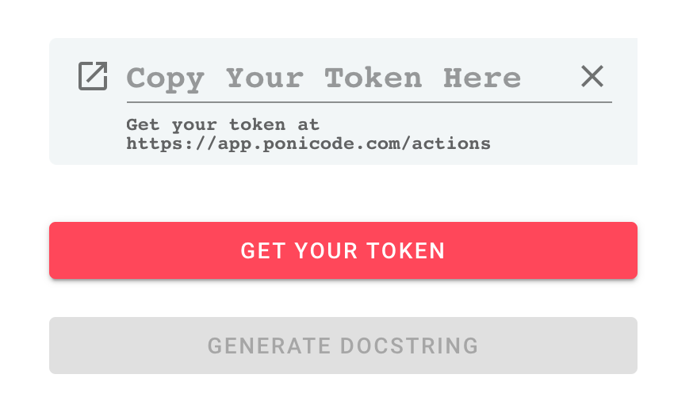

# Get Started

You can access the [DogString Playground](https://api.ponicode.com/playground/) at https://api.ponicode.com/playground/.

## How to Proceed

1. Enter your function in box number 1
2. Click on `GENERATE DOCSTRING`
3. Your function will appear in box number 3 with the docstring generated by our IA.
4. Give us feedback!

You can generate 5 docstrings before a **Ponicode Token** is needed. In order to obtain your **Ponicode Token**, you need to follow these steps:
1. Go to [https://app.ponicode.com/actions](https://app.ponicode.com/actions).
2. Sign in with your **GitHub** or **GitLab** account.

3. Click on authorize Ponicode

4. Copy your token

5. Paste it into the playground

1. The `GENERATE DOCSTRING` button should go green again! Enjoy!

