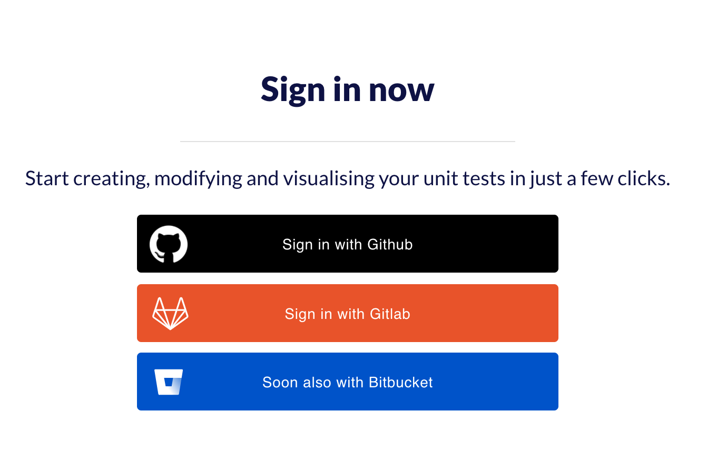
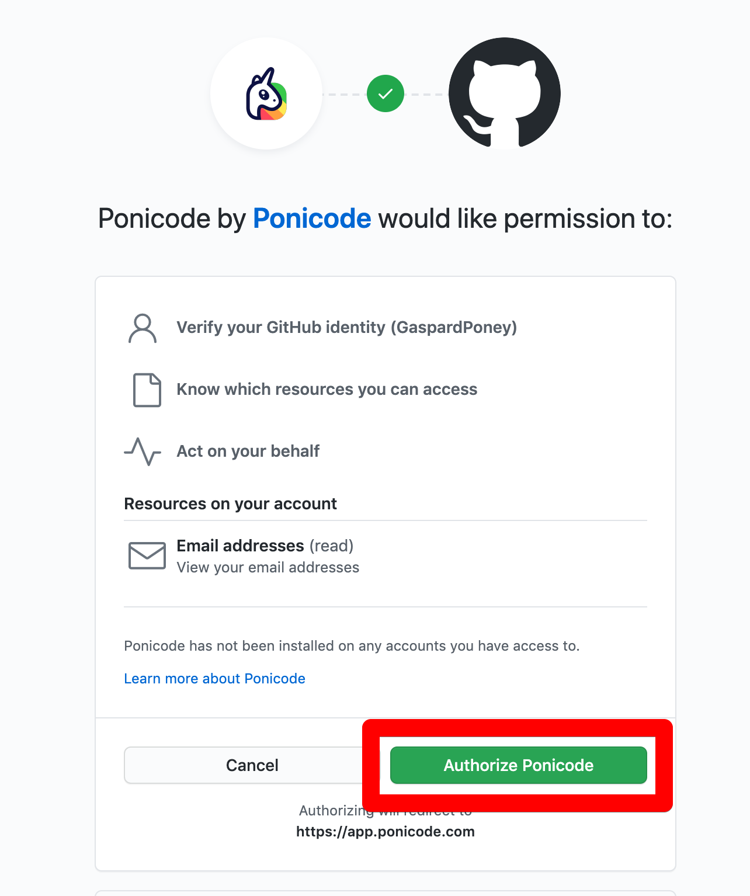
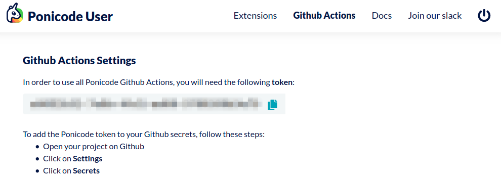
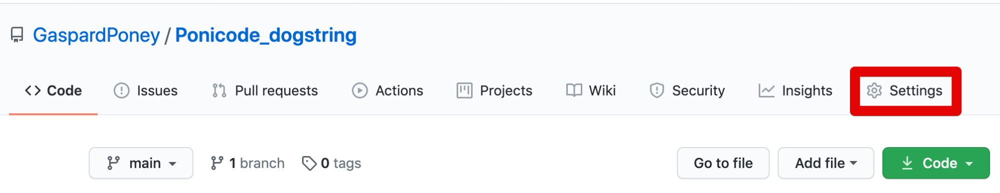
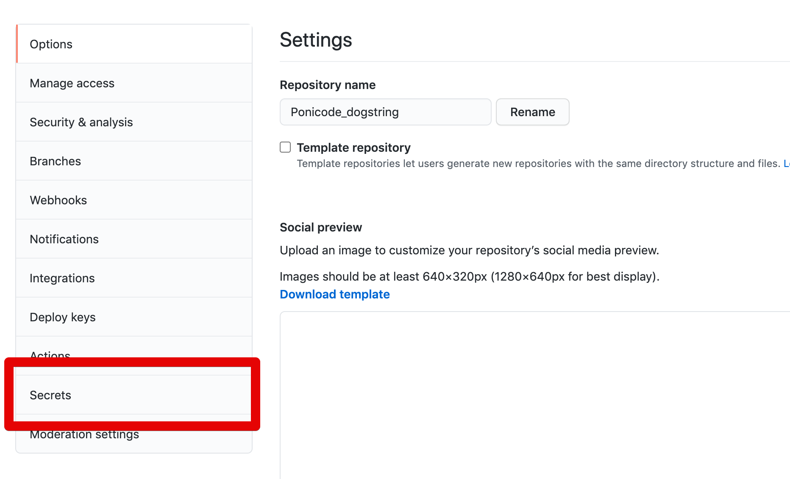
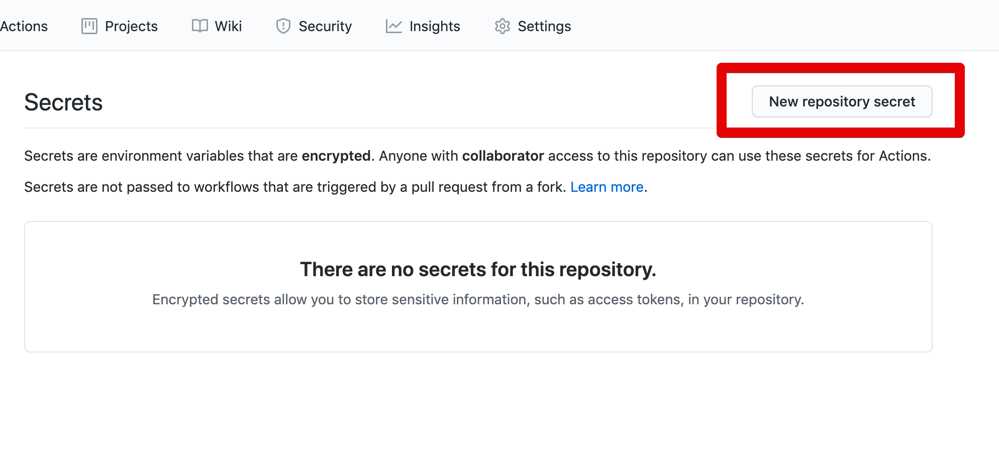
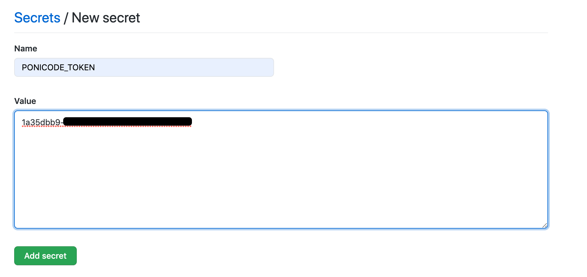
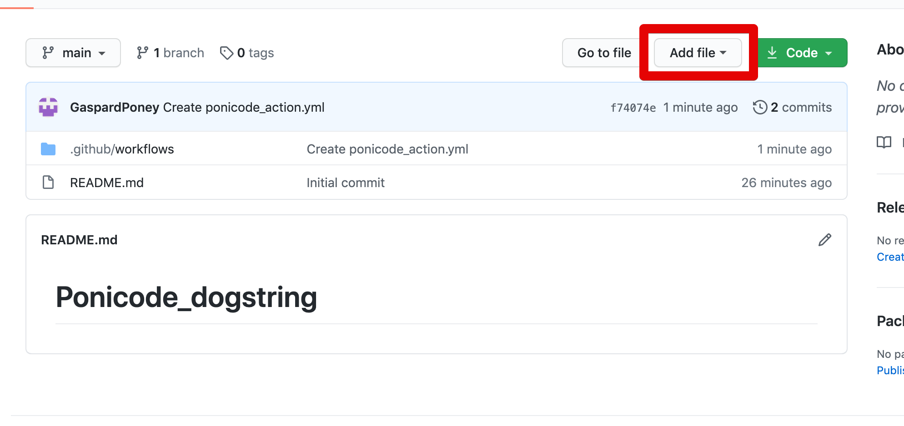
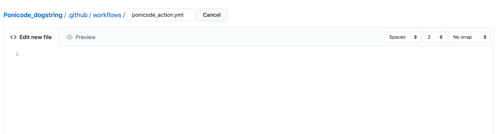
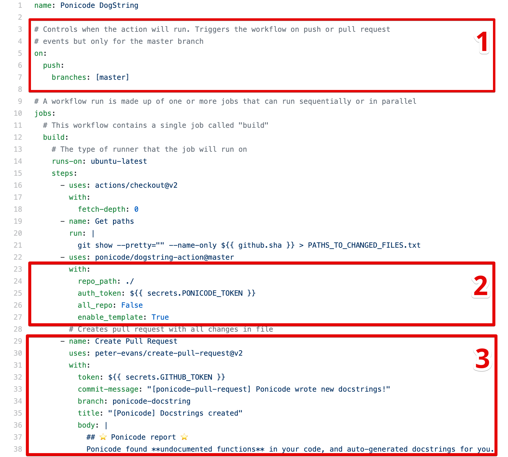

# Use Ponicode DogString Action

## Add your Ponicode Token to your Github secrets

1. Go to [https://app.ponicode.com/actions](https://app.ponicode.com/actions)
2. Sign in with your **GitHub** or **GitLab** account

3. Click on `authorize Ponicode`

4. Copy you tokens

5. Go to your repository where you want to use the action.
6. Go to settings.

7. Click on `Secrets`

8. Click on `New repository secret`

9. Name it *`"PONICODE_TOKEN"`* and paste your token in the **Value**.

10. Click on `Add Secret`
Your Ponicode Token is now added to your repository's secrets!

## Add the YAML file to your repository
You will need to create a yaml file, which will trigger the action, at the following location: `.github/worflows/ponicode_action.yml`
One way of doing it is directly on **GitHub**.
1. Click on `Add File` and create new file

2. Name it `.github/worflows/ponicode_action.yml`

3. Paste one of our example in the Edit new file section
4. Click on commit new file
5. You can now use our Github action to generate docstrings for all your Python files!

### General overview of the YAML file

In the first box you control what will trigger the action.

In the second box you choose the parameters of the action.

- **repo_path:** The relative path in your repository to the files you want Ponicode to test. By default, Ponicode tests your whole repository.
- **auth_token:** String. No default value. You need to add your authentication ponicode token at [https://app.ponicode.com/actions](https://app.ponicode.com/actions)
- **all_repo:** Boolean. By default, the value is False. Choose if you want to write docstrings only on the files you just committed (False) or on all your repository (True)
- **enable_template:** Boolean. By default, the value is true. Choose if you want the docstrings to include the parameters and their types.

Once the docstrings are written, we use the create pull request action to see the results in the branch of your choice. If you want more details go to [https://github.com/peter-evans/create-pull-request](https://github.com/peter-evans/create-pull-request)

You can see the Ponicode Dogstring action and different use cases here: [https://github.com/ponicode/dogstring-action](https://github.com/ponicode/dogstring-action)

