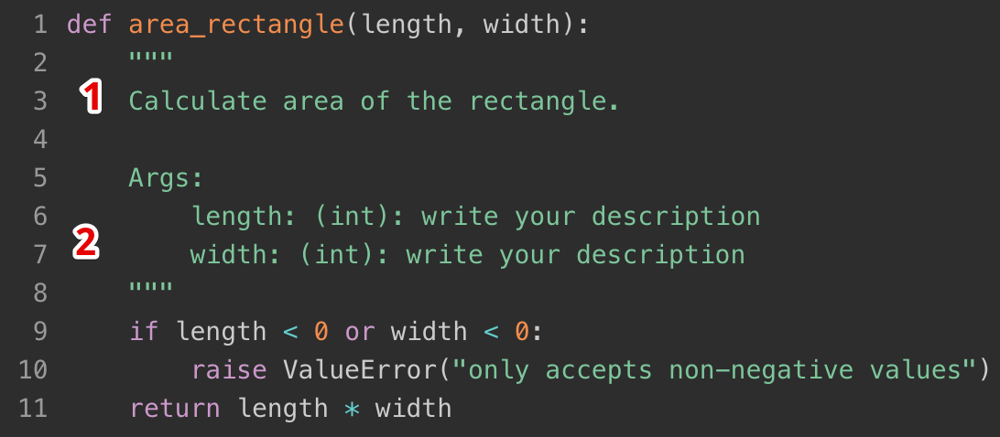

# What Ponicode DogString Action
Ponicode DogString allows you to generate docstring for all your functions.

Our docstrings are following the Google docstring convention. Here is an example:

You have a one-line description of what your function does.

Our model will also infer the type of each of the arguments if they are any but you still have to write their descriptions.