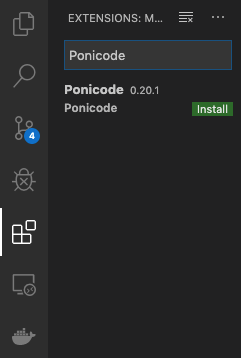
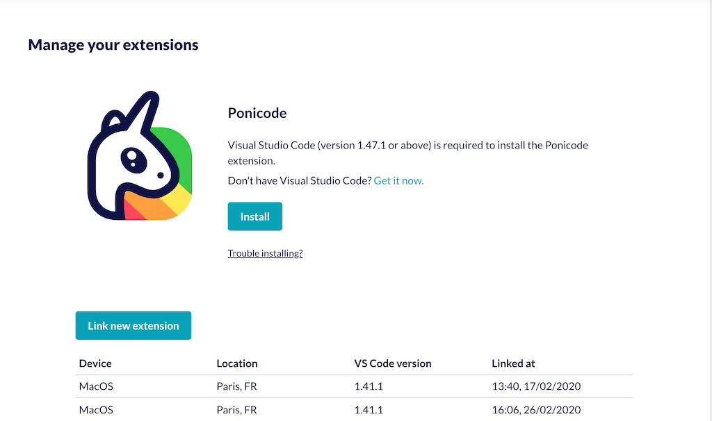
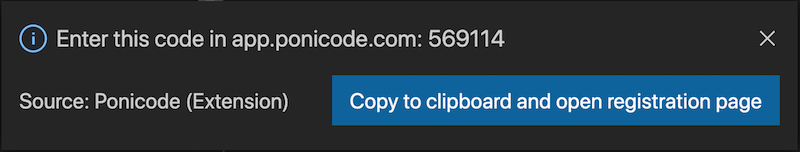

# Installation and Set Up
## First time users
If this is your first time using/installing Ponicode, we highly recommend going through the [**Ponicode wizard**][wizardurl]. Login with your Github or Gitlab account and follow the steps to install and set up Ponicode.

## Installation
You can install the Ponicode VS Code extension directly from the [**VS Code marketplace**][mktvsc].

Alternatively, you can open the VS Code extension from within VS Code. Go to the VS Code activity bar (the left sidebar) and click on the `Extensions` icon. Type "Ponicode" and click on Install. Voilà, you have successfully installed Ponicode within your IDE!

If you are struggling with the previous options you can use the VS Code command line:

1. Enter the shortcut `⌘cmd + P` in VS Code.
2. Enter the following command: `ext install ponicode`.
3. Press `Enter`.

Please note that Visual Studio Code (version 1.37.1) or above is required to install the Ponicode extension.

## Set up
Once the extension is installed, you need to link it to your [**Ponicode account**][wizardurl]. You will have to log in with your Github or Gitlab account.

Go to `Extensions`:

Now click on `Link new extension`. You now need to go back to VS Code and find the 6 digit code that has appeared after installing the extension. A pop-up should have appeared at the bottom right of your screen:

If you can not find the pop-up/it has disappeared, you can also find the code at the left side of the status bar:

[wizardurl]: https://app.ponicode.com/?_ga=2.181941345.799897255.1606397705-1300491394.1603133693
[mktvsc]: https://marketplace.visualstudio.com/items?itemName=ponicode.ponicode
