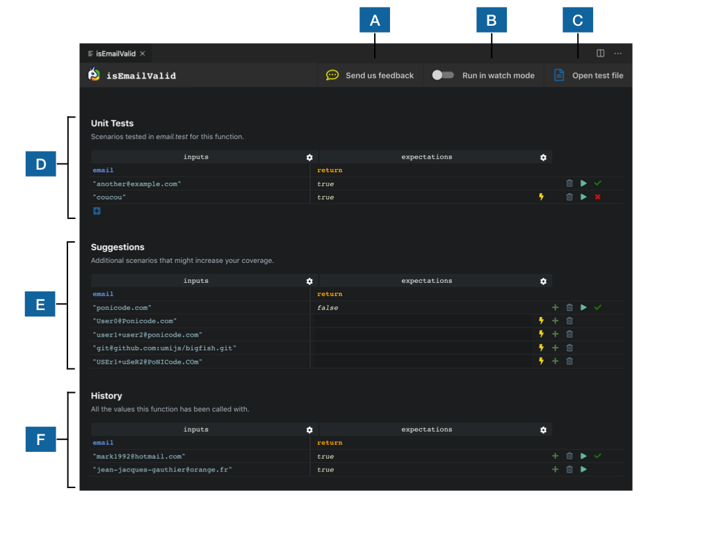

# The Ponicode Interface

## A - Feedback button
Please feel free to send us as any feedback while you use Ponicode. We take all feedback into account and means a great deal to us to involved our users in building the best possible product.

## B - Watch mode
You can toggle watch mode on/off as you create your tests.

## C - Open test file
The tests you add to the Unit Tests section are added directly to your test file. Use this button to open it in a new VS Code tab.

## Sections
- D - [**Unit Tests**](/)
- E - [**Suggestions**](/)
- F - [**History**](/)
All three sections are structured in the same way:

- Two columns: **inputs** and **expectations**
- Rows that represent test cases

The **Inputs** column holds the input values of the tested function.

The **Expectations** column holds the values to be asserted.