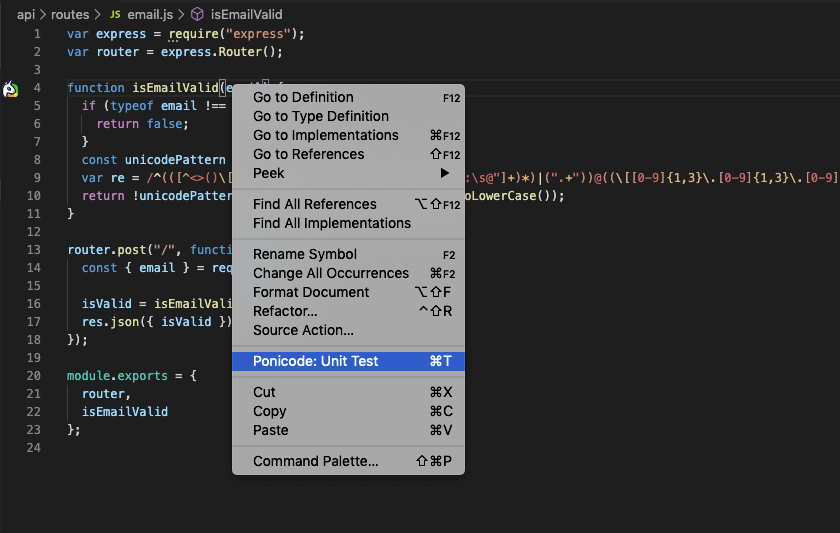
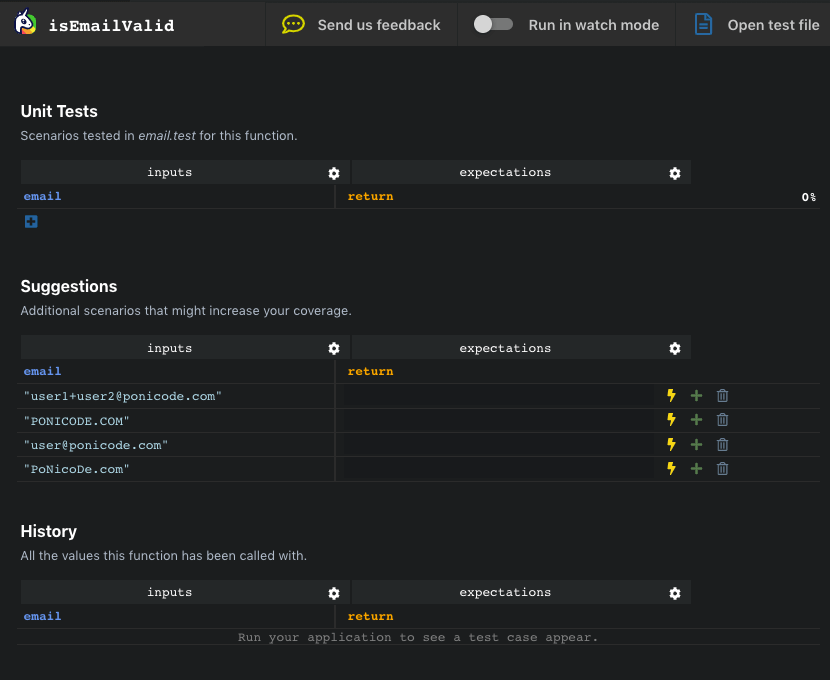
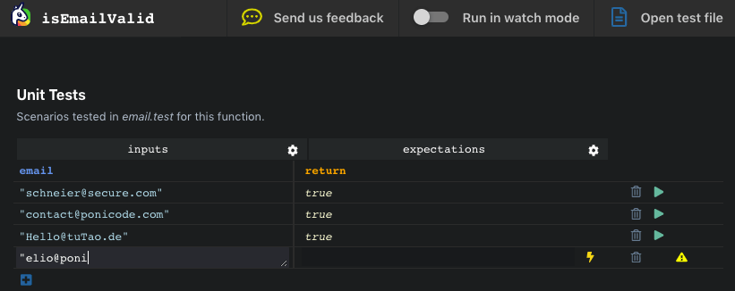
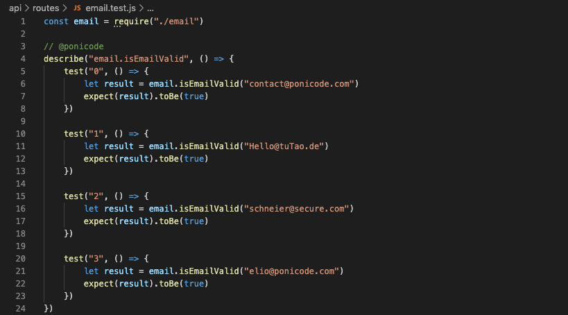
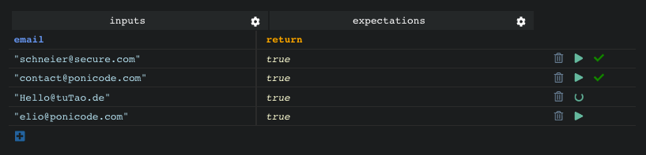
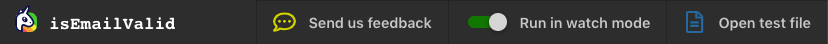

# Tutorial: using Ponicode on our demo project
## Run the demo project
Clone the Ponicode demo project:

```bash
git clone https://github.com/ponicode/demo-project
```
Go to the root of the demo project directory and run the following commands :

```bash
cd demo-project
npm install
npm start
```
## Open the Ponicode interface
In VS Code, open the `filedemo-project/api/routes/email.js`.

The Ponicode logo on the left of a function indicates that Ponicode can help you test that function. Right click on the function `isEmailValid` and select `"Ponicode: Unit Test"` to open the Ponicode interface.



## Suggestions section
As you can see, the only populated section is **Suggestions**. Those are the test cases generated by our AI. For those that seem relevant you can use the <i class="fas fa-bolt" style="color:#E6D838"></i>`bolt` button to run the function in order to automatically populate the expectations column.



Use <i class="fas fa-plus" style="color:green"></i>`plus` to add these test cases to the **Unit Tests** section.

## History section
Go to `http://localhost:3000/`, and use the simple application to check the validity of the different email adresses.


At the bottom of the Ponicode interface, in the section marked **History**, you will see the values that were transiting through the function isEmailValid as you were using the application.


Here again, you can add (<i class="fas fa-plus" style="color:green"></i>`plus`) the test cases you consider most relevant to the Unit Tests section.

## Add test cases manually
Let's add a test case manually now. Give the <i class="fas fa-plus" style="color:green"></i>`plus` button at the bottom of the **Unit Tests** section a click to add a new test case. Once you have filled the inputs column, you can either fill the expectations column manually or let Ponicode do it for you (<i class="fas fa-bolt" style="color:#E6D838"></i>`bolt` Icon).




## Unit Tests section and test file
While we have been playing around in the interface, Ponicode has created a test file `email.test.js` for you. Open it by clicking on `"Open test file"` in the top right corner.



Any action within the **Unit Tests** section will be reflected on the test file and vice-versa.


## Run tests and watch mode
By now you have probably noticed the play sign. You can run the creates/generated test cases within the interface to see wether they pass <i class="fas fa-check" style="color:green"></i>`icon` or fail <i class="fas fa-times" style="color:red"></i>`icon`.



Try toggling on watch mode at the very top of the interface. By doing so the tests will automatically run when created/generated or modified! In addition to running the tests, toggling watch mode will trigger the <i class="fas fa-bolt" style="color:#E6D838"></i>`bolt` icon dynamically for all the generated test cases in the **Suggestions** section.

