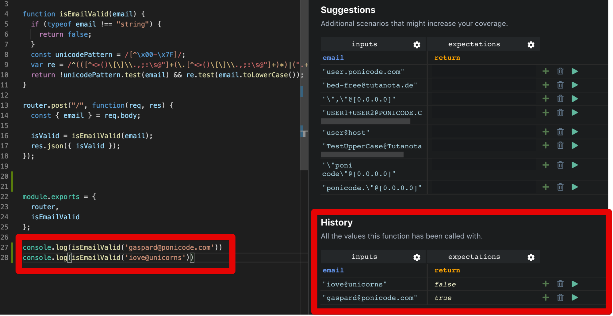

# History
Running your application is a good way to trigger your function in a way that you want to test. When you run your application, Ponicode can catch the function calls and the transiting values to generate test cases. The History section is where you can find them.

## How Does It Work?
To use this functionality you need to install the Ponicode **npm** package.

```bash
npm install -g ponicode
```
You can then run your application using the Ponicode package.
```bash
ponicode node APPLICATION
```

You are good to go! Now, you can interact with your application and whenever you trigger the function you are currently creating tests for, Ponicode will catch the values running through it and populate the History section by creating a new test case row for each function call.

For example, I want to print the output of my function `isEmailValid` in the console.

In my terminal, I run:
```bash
ponicode node email.js
```

My function `isEmailValid` has been called twice with two different inputs. Let's have a look at the **History** section. As you can see, two new tests have been added!


