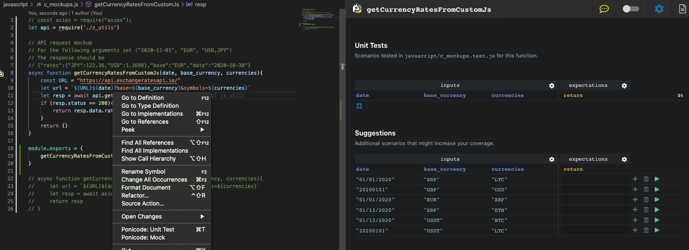
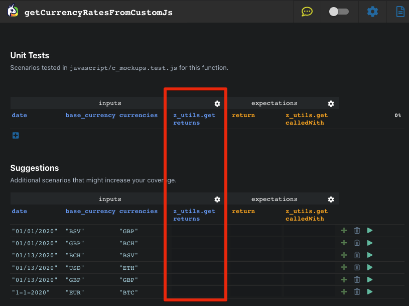
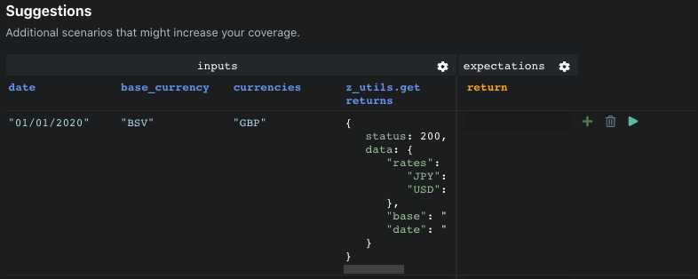

# Mocking

## Mocking Return Value Or Variable

To mock return values of callables do the following:
1. Open the Unit Test Webview for the desired function/method.


2. Right click on the mockable to mock and select `Ponicode: Mock`



3. A new column appear on your Webview



4. You can now fill your test case with the mockup return value desired.



## TypeScript And JavaScript Recommendation

We recommend to always export functions in your project that use mocks or will be mocked, in order to avoid special edge cases proper to JavaScript & TypeScript.

### User-defined functions

Ponicode can mock functions that are defined in the same projects.

Those functions must be exported.

- We do not support mocking non-exported functions
- We do not support mocking conditionally exported functions
- We do not support mocking direct exports (for example: module.exports = function ())

#### Examples
##### <i class="fas fa-check" style="color:green"></i>Works
```javascript
const db = require('./db')
function foo () {
    db.query()
}
module.exports = { foo }
```
##### <i class="fas fa-times" style="color:red"></i>Fails
```javascript
const { query } = require('./db')
function foo () {
    query()
}
module.exports = { foo }
```
The reference to `db.query` was copied before the mock was set up.

##### <i class="fas fa-times" style="color:red"></i>Fails with Jest
```javascript
const query = require('./db').query
function foo () {
    query()
}
module.exports = { foo }
```
`foo` and `db` will not live in the same context, because foo is not exported and **Jest** uses another **JavaScript** engine.

**Work around:** Export `foo`

What will happen?
1. **Jest** is launched
2. `foo` is imported via `rewire`, and will live in **Node** context
3. `db` is imported by `foo`, and will live in **Node** context.
4. From the test file, `db` is imported via **Jest**’s `require`, and will live in **Jest**’s context.
5. **Jest** will mock `db` in **Jest**’s context.
6. `foo` will call `db.query` in **Node**’s context, the mock will not work.
This is a Ponicode-specific limitation.

### Package Functions
Ponicode can mock functions that are defined in node modules.
Ponicode can also mock functions from **Node** built-in modules (`fs`, `util`, etc.).

#### Exclusions
- The tested function must be exported (this is a Ponicode-specific limitation).
- We do not support mocking direct exports.

#### Examples

<i class="fas fa-check" style="color:green"></i>Works
```javascript
const axios = require('axios')
function foo () {
    axios.get()
}
module.exports = { foo }
```

##### <i class="fas fa-times" style="color:red"></i>Fails
```javascript
const axios = require('axios')
function foo () {
    axios.get()
}
```
`foo` is not exported. Ponicode-specific limitation.

##### <i class="fas fa-times" style="color:red"></i>Fails
```javascript
const { get } = require('axios')
function foo () {
    get()
}
module.exports = { foo }
```
The reference to `axios.get` was copied before the mock was set up.

##### <i class="fas fa-times" style="color:red"></i>Fails
```javascript
const axios = require('axios')
function foo () {
    axios()
}
module.exports = { foo }
```
We cannot mock `axios` itself. This is a Ponicode-specific limitation.

##### <i class="fas fa-times" style="color:red"></i>Fails
```javascript
const pkg = require('package')
function foo () {
    pkg[0]()
}
module.exports = { foo }
```
We cannot mock `pkg[0]`. Only simply exported members are supported. This is a Ponicode-specific limitation.

### Native functions
Ponicode can mock native functions that do not need to be imported. Here are some examples.

#### Javascript
Example: `Math.random`

#### Node
Example: `Buffer.from`

#### Browser
Example: `fetch`

### About variable mocking
Ponicode can mock global variables that are defined in the same file as the tested function.
#### Criterias
- The variable must be defined in global scope.
- If you want to stub the variable, the variable must not be a constant.

[](https://www.youtube.com/watch?v=fB14LNRZRIQ)
