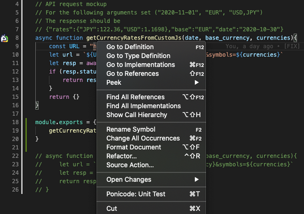

# Mocking

## Mocking Return Value Or Global

To mock return values of callables do the following:
1. Open the Unit Test Webview for the desired function/method.

2. Right click on the mockable to mock and select `Ponicode: Mock`

3. A new column appear on your Webview

4. You can now fill your test case with the mockup return value desired.

## TypeScript And JavaScript Recommendation

We recommend to always export functions in your project that use mocks or will be mocked, in order to avoid special edge cases proper to JavaScript & TypeScript.

### User-defined functions

Ponicode can mock functions that are defined in the same projects.

Those functions must be exported.

- We do not support mocking non-exported functions
- We do not support mocking conditionally exported functions
- We do not support mocking direct exports (for example: module.exports = function ())

#### Examples
<i class="fas fa-check" style="color:green"></i> Works
