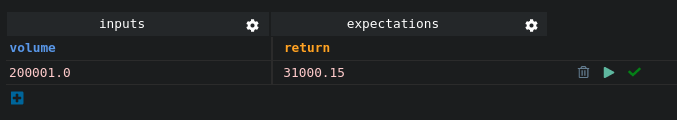
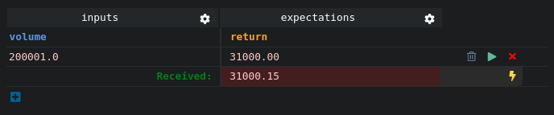
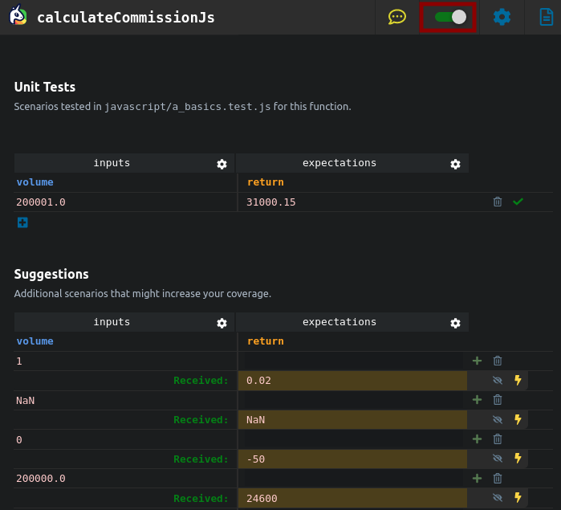

# Test Case Running

You might want to run your test cases to see whether they pass (<i class="fas fa-check" style="color:green"></i>) or fail (<i class="fas fa-times" style="color:red"></i>). There are two ways to do this:
- Run your test cases individually by using the <i class="fas fa-play" style="color:green"></i>`Play` button on the right hand side of the test case row.
- Use watch mode.

## Play Button
To run your test, you can click on the <i class="fas fa-play" style="color:green"></i>`Play` button and get a Check icon on the right when the test passes.

If the test fails, you will get a <i class="fas fa-times" style="color:red"></i>`Cross` icon to indicate this. You can then make the test pass by clicking on the <i class="fas fa-bolt" style="color:#E6D838"></i>`Bolt` icon to correct it.

## Watch Mode
If you want your tests to run automatically while you code, use Watch Mode by activating it with the toggle in the top right corner.

Your tests will then run automatically as you code and you will see your units' behavior evolution live.