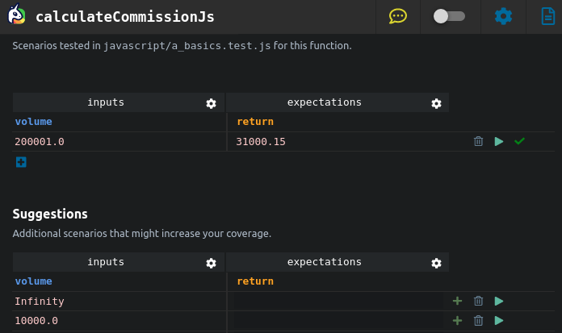

# Test Cases Suggestions

The **Suggestions** section is where you can interact with Ponicode's AI generated test cases. This section is populated when you open the interface for the first time and will be updated as you interact with it. In order to give you the best possible suggestions, Ponicode looks at:

- The tested function
- A lot of code

When suggestions are generated, you will notice that only the inputs columns are populated. You can either fill the expectations column by hand, or let Ponicode do it for you by using the <i class="fas fa-bolt" style="color:#E6D838"></i>`Bolt` button on the right hand side of the test case row after running the test case using the <i class="fas fa-play" style="color:green"></i>`Play` button.

## Adding Test Cases

If you spot some test cases that seem relevant to you, you can easily add them to the **Unit Tests** section (which will add them to your test file) by using the <i class="fas fa-plus" style="color:green"></i>`Plus` button on the right hand side of each test case row.

## Removing Test Cases

To remove a test case, simply click on the <i class="fas fa-trash-alt" style="color:gray"></i>`Bin`icon at the right side of the test case row.

