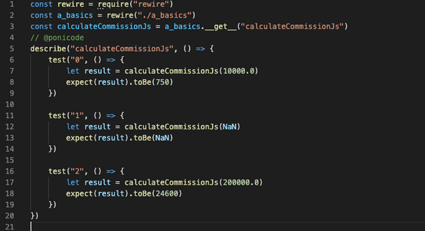
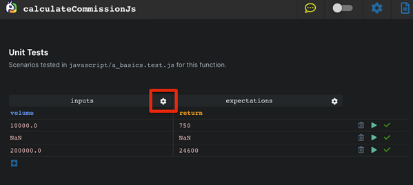
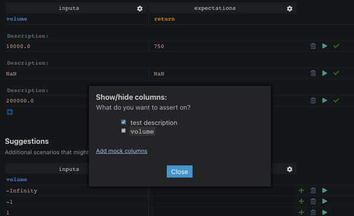
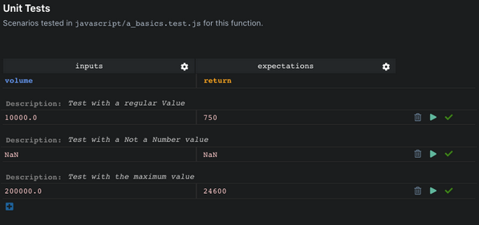

# Test Description

By default, you observe your tests’ descriptions are named by the Ponicode Extension with indices *"0"*, *"1"*, *"2"*, *"3"*, etc.

You can provide a more accurate description of your test cases in the Ponicode Webview by setting on the `test description`. Go to the **Webview** and open the `Show/Hide columns` modal by clicking on the <i class="fas fa-cog" style="color:black"></i>Gear symbol icon.

Toggle the `test description` button on the modal to activate the description above each test case.

You can now add your description above each test case.

