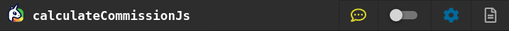
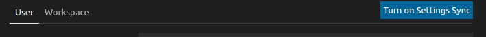
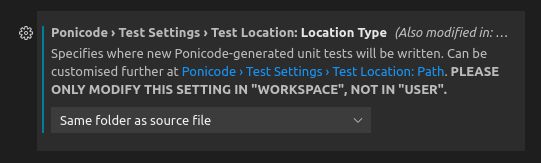
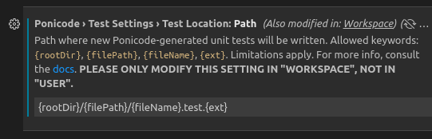

# Test Location

Ponicode allows configuring where your unit tests are written.

To change the settings, open your preferences (<kbd> cmd </kbd> + <kbd> , </kbd>), then type in the search bar *"Ponicode test location"*.

Alternatively, you can open the settings directly from your Ponicode interface, by clicking on the <i class="fas fa-cog" style="color:blue"></i>`Test settings` icon on the top right corner.

Two fields can be modified: `Test Location: Location Type` and `Test Location: Path`. Each of them can be configured by `User` or `Workspace`.
## User or workspace?

You have a choice to configure your settings by `User` or `Workspace`. We recommend always using the `Workspace` section (unless no workspace is open), but priority of how the settings are considered is dictated by VS Code rules.

### Test Location: Location Type

This field can take one of the following three values:
- Same path as source file
- In folder *"\_\_tests\_\_"* at worspace root
- Custom

`Same path as source file` and `In folder __tests__ at worspace root` are the two options recommended by Ponicode, and they are associated with strict Test location paths. If you want to customise your path, just select "Custom" and adjust the path as you like.

### Test Location: Path
The following keywords can be used to defined the path:
- *"{rootDir}"*: refers to the workspace folder that each file is contained in, or - when a file is not in a workspace - the path of the file itself.
- *"{filePath}"*: refers to the relative path from the {rootDir} to the file a test should be created for, excluding the filename itself. This can be - used to recreate the same file tree in a separate tests folder, for example.
- *"{fileName}"*: refers to the basename of the file a test should be created for, excluding its extension.
- *"{ext}"*: refers to the extension of the file a test should be created for. It must be preceded by the character *"."*

The following constraints apply to the combination that can be created using the above keywords.
- Characters allowed in directory and file names are restricted to: *[a-z]*, *[A-Z]*, *[0-9]*, *"_"* (underscore), *"#"* (dash), *"."* (dot) and *" "* (space). All other characters are considered invalid.
- *"."* and *".."* are accepted as valid directories.
- Each keyword can be used only once in the path. All of them are optional, except for *"{ext}"* which is mandatory.
- The path cannot be absolute. If it does not begin with *"{rootDir}"* or *"."*, it is assumed as implicit.
- For now, no directory can be excluded from the *"{filePath}*".For example, if the path for a file is *"{rootDir}/src/foo/bar/myFile.js"*, it is not possible to exclude src from the *"{filePath}"*. This means that Ponicode generated tests cannot be written in a path such as *"{rootDir}/tests/foo/bar/myFile.js"*. Instead, it is possible to write into: *"{rootDir}/tests/src/foo/bar/myFile.js"*
- The following path (and its synonyms) is considered invalid because the test file would have the same path as the source file: *"{rootDir}/{filePath}/{fileName}.{ext}"*

**Note:** for the time being, the same convention applies to all files in the same workspace - irrespectively of language. In the future, we will allow to define different test file location conventions for unit tests of each different language supported by Ponicode.