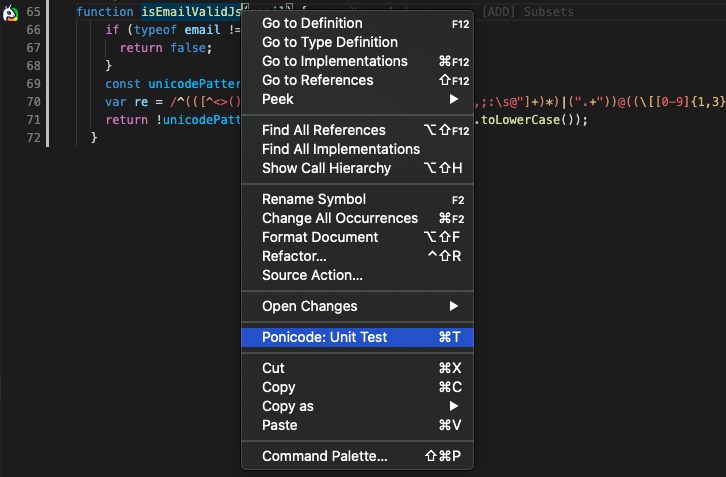
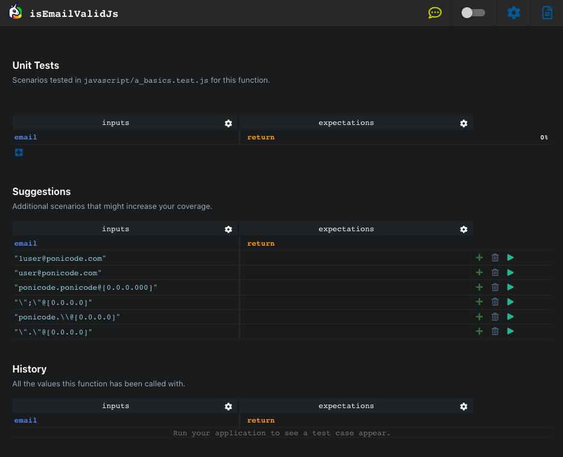
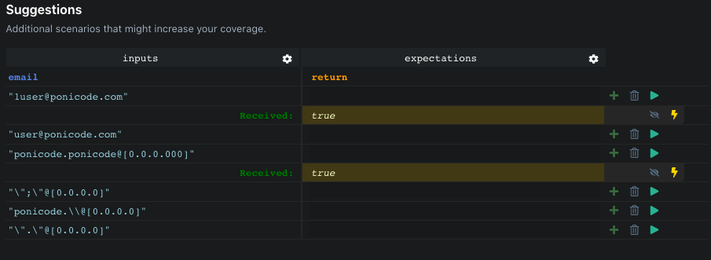
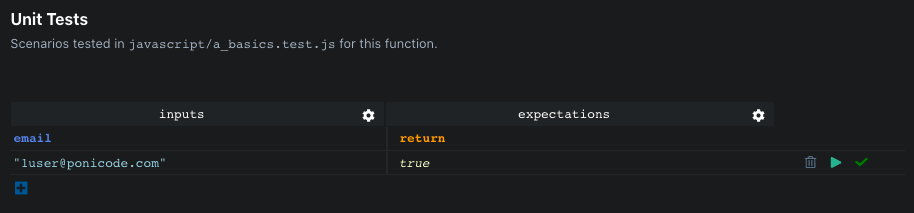
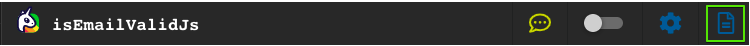

# Get Started

## Clone the Demo Project

As a sample project, we provide a repository for you to be acquainted with the Ponicode Unit Test Extension for VS Code.

First of all, to clone the demo project open you terminal and do the following:

```bash
git clone https://github.com/ponicode/demo-project.git
cd demo-project
```

Your demo project should have the following structure

```
.
├── instrumenter    # Example project for Ponicode Runtime Instrumentation
│   ├── api         # Sample Back End with ExpressJS
│   └── client      # Sample Front End with ReactJS
├── javascript      # JavaScript examples and demonstration
├── python          # Python examples and demonstration
├── typescript      # TypeScript examples and demonstration
└── README.md
```

## Install the requirements

For `JavaScript` & `TypeScript` you'll need to install the requirements to run the demo-project.

```bash
cd [javascript|typescript]
npm ci
```

## Open the Ponicode Interface

This section is replicable for any language you seek. Go to the desired folder and open the `a_basics.[js|py|ts]` file

> **<span style="color:orange">DISCLAIMER<span>**
>
> Ponicode Extension `>= 0.25.0` is required for TypeScript support

Look for the `isEmailValid[Js|Py|Ts]` function. The Ponicode logo on the left of a function indicates that Ponicode can help you test that function. Right click on the function `isEmailValid[Js|Py|Ts]` and select _"Ponicode: Unit Test"_ to open the Ponicode interface.



```javascript
function isEmailValidJs(email) {
	if (typeof email !== "string") {
		return false
	}
	const unicodePattern = /[^\x00-\x7F]/
	var re = /^(([^<>()\[\]\\.,;:\s@"]+(\.[^<>()\[\]\\.,;:\s@"]+)*)|(".+"))@((\[[0-9]{1,3}\.[0-9]{1,3}\.[0-9]{1,3}\.[0-9]{1,3}\])|(([a-zA-Z\-0-9]+\.)+[a-zA-Z]{2,}))$/
	return !unicodePattern.test(email) && re.test(email.toLowerCase())
}
```

```python
def isEmailValidPy(email):
    result = re.search(r"^[A-Za-z0-9\.\+_-]+@[A-Za-z0-9\._-]+\.[a-zA-Z]*$", email)
    return bool(result)
```

```typescript
function isEmailValidTs(email: string) {
	const unicodePattern = /[^\x00-\x7F]/
	var re = /^(([^<>()\[\]\\.,;:\s@"]+(\.[^<>()\[\]\\.,;:\s@"]+)*)|(".+"))@((\[[0-9]{1,3}\.[0-9]{1,3}\.[0-9]{1,3}\.[0-9]{1,3}\])|(([a-zA-Z\-0-9]+\.)+[a-zA-Z]{2,}))$/
	return !unicodePattern.test(email) && re.test(email.toLowerCase())
}
```

On the left hand side, the **Ponicode interface** is now opened.



## Create your first test

The webview is composed of 2 sections:

- **Unit Tests**: Test already generated by Ponicode
- **Suggestions**: Suggestions provided by Ponicode AI Engine for useful test cases

Ponicode Unit Test Extension analyze your code and provides test case suggestions in the `Suggestions` section. For each test case suggestion you have:

- `inputs` _columns_: Input arguments generated by Ponicode AI engine
- `expectations` _columns_: Return values and other expectations
- <i class="fas fa-plus" style="color:green"></i>`plus` _button_: Add the test case to the test file
- <i class="far fa-trash-alt" style="color:grey"></i>`bin` _button_: Remove the test case
- <i class="fas fa-play" style="color:green"></i>`play` _button_: Run the test case

You can fill in the `return` column the value you are expecting for the test case OR you can run the test case with the <i class="fas fa-play" style="color:green"></i>`play` button. Once clicked, wait a moment to obtain the **received** values for return and other expectations.



If the received value is the expected one you can accept it with the <i class="fas fa-bolt" style="color:#E6D838"></i>`bolt` button.

Now you can save you test case by adding it with the <i class="fas fa-plus" style="color:green"></i>`plus` button



**CONGRATULATION!**, you have created your first test with Ponicode. A new `a_basics.test.[js|py|ts]` file is available in your folder. You can consult you file with the Ponicode Interface by clicking on the `Open Test File` button on the Ponicode Interface Navbar


