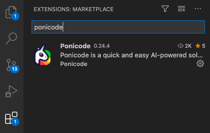
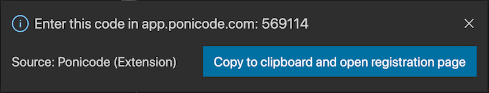
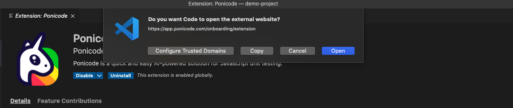
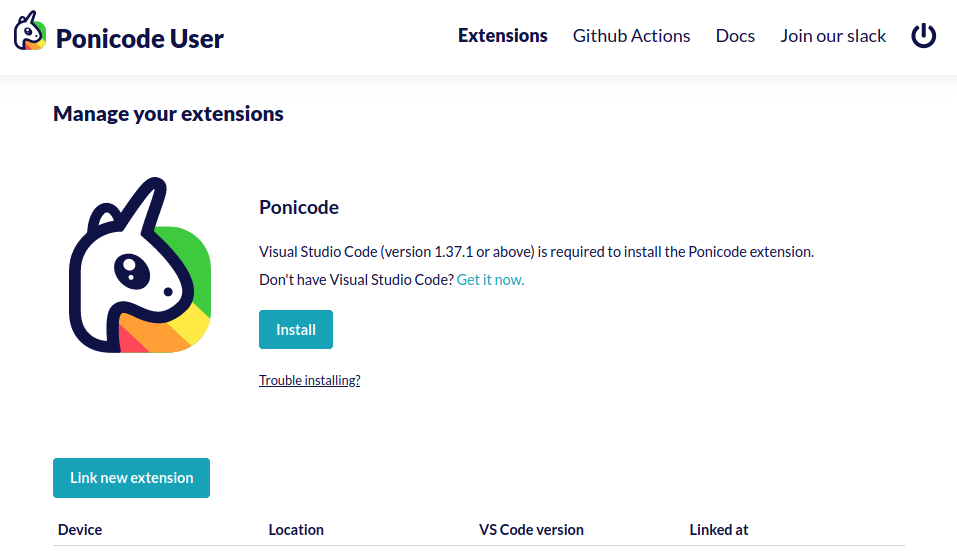

# Installation

## First time users - Create your Ponicode Account

If this is your first time using/installing Ponicode, we highly recommend going through the [**Ponicode wizard**][wizard]. Login with your Github or Gitlab account and follow the steps to install and set up Ponicode.

## Install the extension
You can install the Ponicode VS Code extension directly from the [**VS Code marketplace**][extension].

Alternatively, you can open the VS Code extension from within VS Code. Go to the VS Code activity bar (the left sidebar) and click on the `Extensions` icon. Type *"Ponicode"* and click on `Install`. Voilà, you have successfully installed Ponicode within your IDE!

If you are struggling with the previous options you can use the VS Code command line:

1. Enter the shortcut <kbd> cmd </kbd> + <kbd> P </kbd> in VS Code.
2. Enter the following command: `ext install ponicode`.
3. Press `Enter`.

> **NOTE**
>
> Visual Studio Code (version 1.37.1) or above is required to install the Ponicode extension.

## Link your extension to your account
Once the extension is installed, a Ponicode message is displayed in a popup at the bottom-left of your VS Code instance inviting you to copy your One Time Password `OTP`. This OTP is needed to link your extension with your Ponicode Account

> **NOTE**
> touches de clavier en anglais
> If you can not find the pop-up or it has disappeared, you can also find the code at the left side of the status bar:
> 

Click on the `Copy to clipboard and open registration page` button to be redirected to the [**Ponicode Wizard**][wizard]

> **NOTE**
>
> You might be invited by your VS Code instance to open the external website
> 

You will have to log in with your Github or Gitlab account and go to the `Extensions` section

Now click on `Link new extension`, paste your One Time Password and clienk on the `Link` button.

**CONGRATULATION!**, you are now able to use Ponicode with VS Code.

To confirm the link was successfull you should see `Ponicode: 🚀 Ready` on your VS Code footer bar.

[wizard]: https://app.ponicode.com
[extension]: https://marketplace.visualstudio.com/items?itemName=ponicode.ponicode

